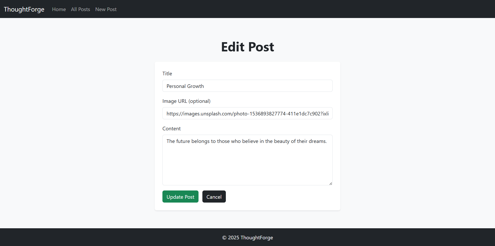

# ThoughtForge 🧠

A clean, full-CRUD blog application built with **Node.js**, **Express**, **MongoDB (Mongoose)**, **EJS**, and **Bootstrap** - users can create, view, edit, and delete posts via a simple, responsive UI.

---

## Technologies Used

- Node.js  
- Express  
- MongoDB  
- Mongoose  
- EJS  
- Bootstrap 5
- Custom CSS

---

## Features

- **Full CRUD support** (Create, Read, Update and Delete)
- **Server-side rendering** using EJS and `express-ejs-layouts`
- **Responsive and clean UI** with Bootstrap 5
- **MongoDB database** powered by Mongoose models
- **Optional image URLs** for posts
- **RESTful routing** following standard web patterns

---

## Preview

### Home Page


### All Posts


### Add Post


### Edit Post


### Post Page


---

## Getting Started

1. **Clone the repository**
```bash
git clone https://github.com/Misba0019/ThoughtForge.git
cd ThoughtForge
```

2. **Install dependencies**
```bash
npm install
```

3. **Start the server**
```bash
npm run dev
```
(or use `nodemon index.js` directly if you prefer)

4. Open in browser:`http://localhost:3000`

---

## Planned Improvements

- User authentication (signup, login, logout)
- Authorization (only the author can edit/delete their posts)
- Form validation & proper error handling
- Image upload support
- Search functionality and basic categories/tags

---

## Credits

Images sourced from [Unsplash](https://unsplash.com).

---

## License

This project is licensed under the MIT License - see the [LICENSE](LICENSE) file for details.