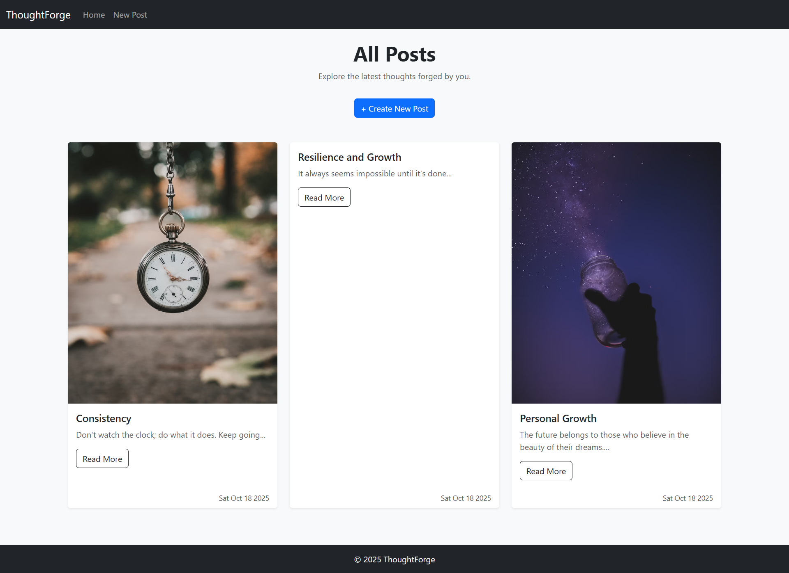
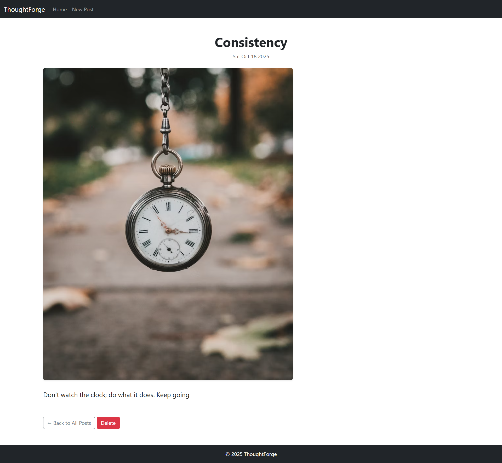

# ThoughtForge 🧠

A simple blog web app built with **Node.js**, **Express**, **MongoDB (Mongoose)**, and **EJS**.  
It lets you create, view, and delete posts — with a responsive UI built using **Bootstrap** and clean EJS layouts.

---

## Features

- Create, read, and delete blog posts
- EJS templating with `express-ejs-layouts`
- Responsive UI with Bootstrap
- MongoDB integration via Mongoose

---

## Preview

### Home Page


### All Posts


### Add Post


### Post Page


---

## Technologies Used

- Node.js  
- Express  
- MongoDB  
- Mongoose  
- EJS  
- Bootstrap 5

---

## Getting Started

1. **Clone the repository**
```bash
git clone https://github.com/Misba0019/ThoughtForge.git
cd ThoughtForge
```

2. **Install dependencies**
```bash
npm install
```

3. **Start the server**
```bash
npm run dev
```
(or use `nodemon index.js` directly if you prefer)

4. **Open in browser**
```bash
http://localhost:3000
```

---

## Credits

Images used in this project are sourced from [Unsplash](https://unsplash.com).

---

## License

This project is licensed under the MIT License - see the [LICENSE](LICENSE) file for details.